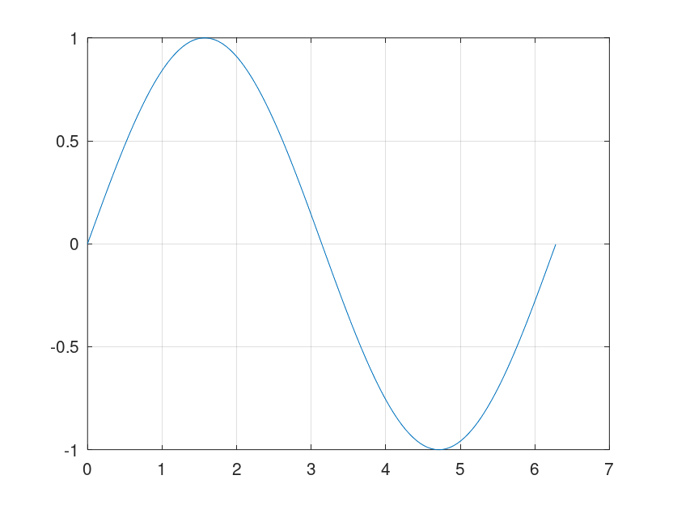
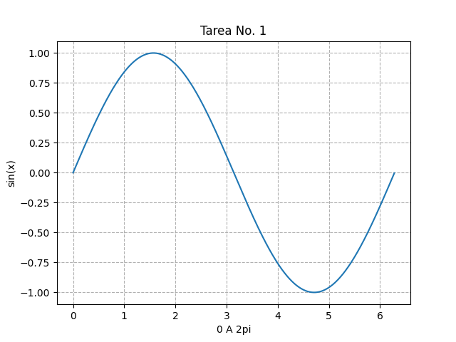

 <h1>Tareas Proyectos de Computación Aplicados a IE</h1> 

<<<<<<< HEAD
      
=======
       
>>>>>>> cee20b75900b242c708b3078b01911d33ce41f96

# Tareas Proyectos
En este respositorio se estaran subiendo todas las tareas de la clase de Proyectos de Computación, todas la tareas estaran subidas en una carpeta invidual con el nombre de la tarea que corresponda, por ejemplo: T1

- [Tarea #1](#tarea-1-grafica-de-la-onda-seno)
- [Tarea #2](#tarea-2)
<<<<<<< HEAD
=======
- [Tarea #3](#tarea-3)
>>>>>>> cee20b75900b242c708b3078b01911d33ce41f96

# Tarea #1: Grafica de la onda Seno

  
Contenido Tarea 1

## Gráfica Generada por GNU Octave

## Gráfica Generada por Python

[Tareas](#tareas-proyectos)

# Tarea #2

  
Contenido Tarea 2

[Tareas](#tareas-proyectos)

[Tareas](#tareas-proyectos)
<<<<<<< HEAD
=======

# Tarea #3

  
Contenido Tarea 3

[Tareas](#tareas-proyectos)

[Tareas](#tareas-proyectos)
>>>>>>> cee20b75900b242c708b3078b01911d33ce41f96
